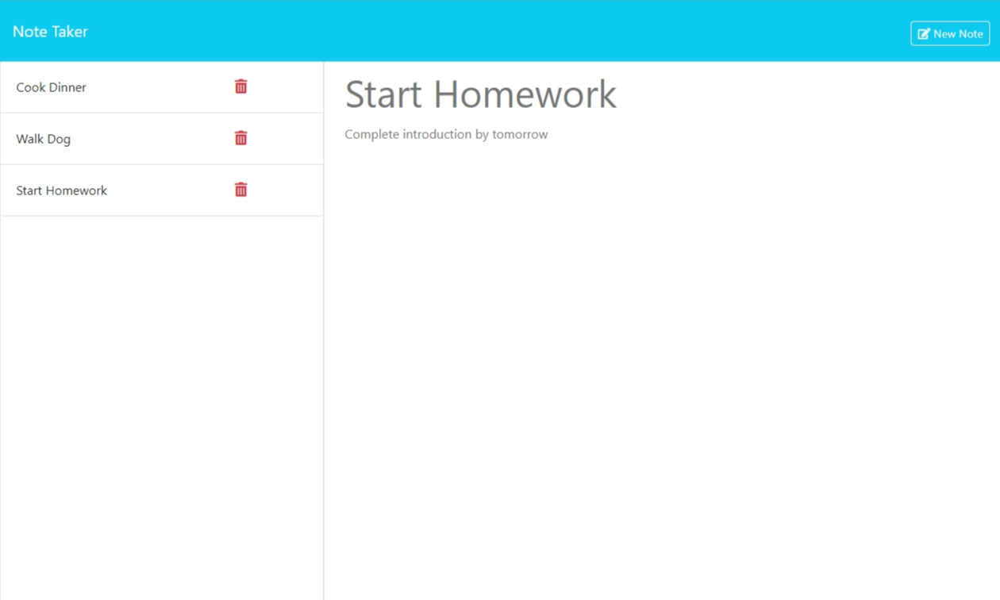

# Note Taker

## Table of Contents
-[Link](#link)  
-[Description](#description)  
-[Installation](#installation)  
-[Usage](#usage)  
-[Contributing](#contributing)    
-[Credits](#credits)  
-[License](#license)  
-[Questions](#questions)

## Link
[Link to deployed app](https://thawing-depths-70546-5db0d70ae121.herokuapp.com/)

## Description
This is a note taking application where you can write and save notes and to-do's. It was made for small business owners, students, and anyone else who needs to be able to write and save notes to organize tasks that need to be done. It was created using CSS, HTML, and JavaScript on the front end and Node.js, Express.js, npm, and the npm package uuid on the back end. It is deployed using Heroku.

## Installation
To be able to use this app you first need to install node.js to your machine. Then, you will need to install npm and the npm packages Express, and uuid. 

## Usage
To use this app, first go to the deployed website. There you will see a landing page with a link to a notes page. Click on that link and you will be brought to the page where you can see current notes, enter new notes, and delete un-needed notes. To enter a new note, enter text in the fields that say "Note Title" and "Note Text" in the right hand column and then click the save button that appears in the header. You can also create a new note by clicking on an existing note, and then clicking the "New Note" button that appears, and then follow the same steps. To delete a note, simply click the red trash can next to an existing note.

## Contributing
To contribe, fork the project, create a branch to work on, edit tha branch, and then create a pull request. If the edits are approved, your contributions will be added. 

## Credits
This app's static files were sourced with some edits from a Uconn web development bootcamp in the following repo: https://git.bootcampcontent.com/University-of-Connecticut/CONN-VIRT-FSF-PT-07-2023-U-LOLC.git. The server.js file was created by me. The documentation for express.js, node.js, uuid, and heroku were all referenced.

## License
This project is not protected under any license.

## Questions
To view more of my work, view my GitHub profile: [adaking1](https://github.com/adaking1)

If you have any questions about this project please email me here: kinga1215@yahoo.com

